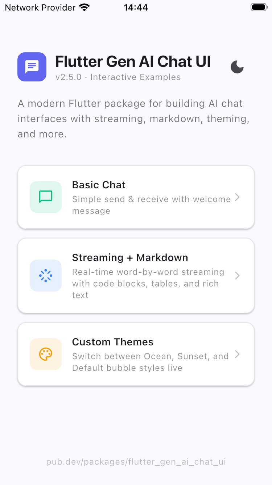
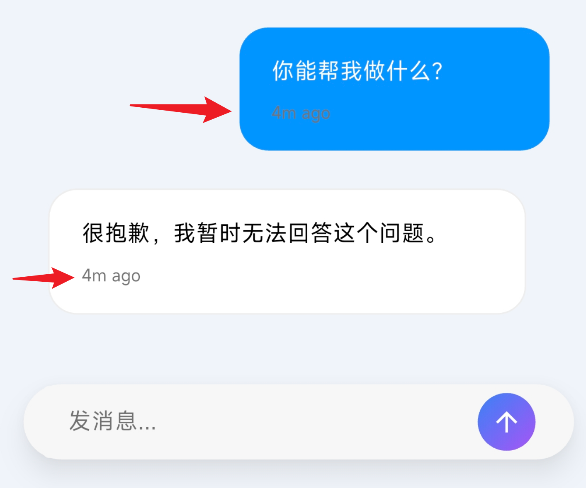
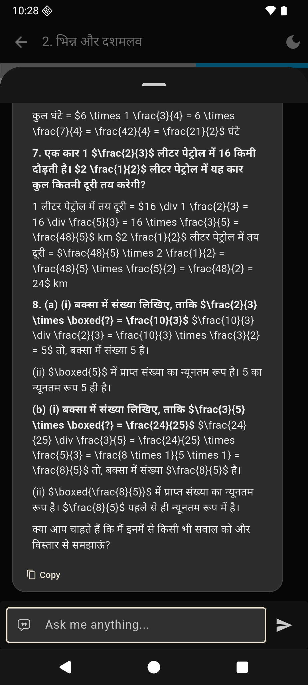
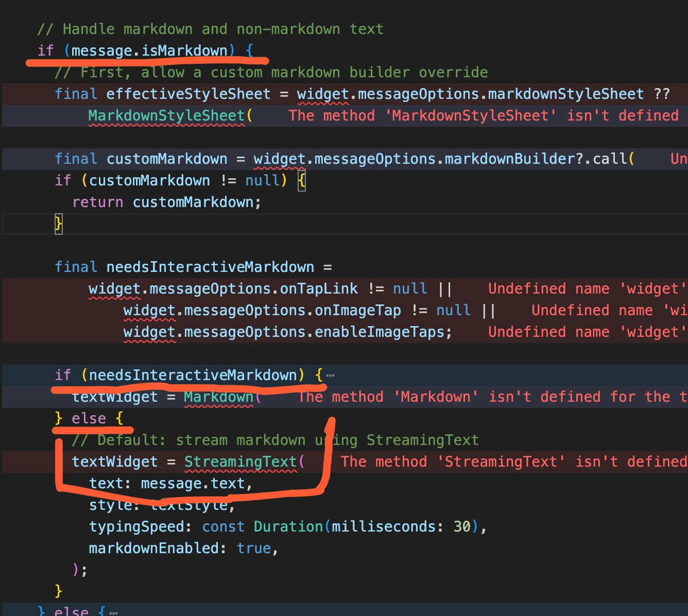
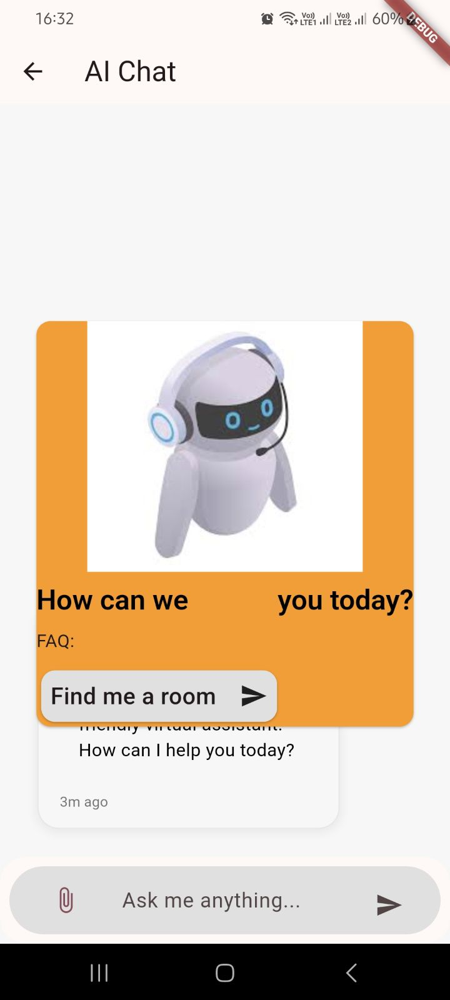
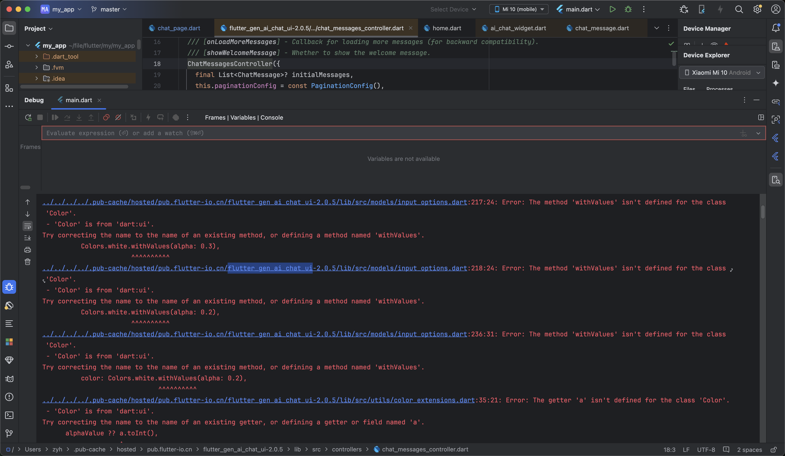
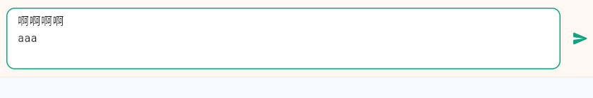

# GitHub Issues — Full Review Dossier

**Repo:** `hooshyar/flutter_gen_ai_chat_ui`
**Generated:** 2026-05-31
**Source:** `gh issue list --state all` (issue bodies + every comment) + all attached images downloaded locally to `images/`
**Purpose:** A single, self-contained, AI-readable record of every issue ever filed, including screenshots (with text descriptions so an AI can reason about them without rendering), so we can investigate what still needs action.

Issue numbers are not contiguous — gaps (#1, #11, #16, #17, #21, #26, #27, #34, etc.) were pull requests or deleted items and never appear in the issues list.

- **Total issues:** 31 (1 open, 30 closed)
- **Images captured:** 7 (issues #9, #12-comment, #22, #24, #25, #29, #35)

---

## 1. Triage summary

| # | Title | State | Type | Needs action now? |
|---|-------|-------|------|-------------------|
| **39** | **Stop generating button** | **OPEN** | Feature / support | **Yes — doc + example recipe.** Buildable today with existing APIs (`sendButtonBuilder`/`sendOrMicBuilder` + consumer's own `StreamSubscription.cancel()` + `controller.stopStreamingMessage`). No package code strictly required. |
| 9 | sendOnEnter is invalid | Closed | Bug | **Verify.** Late comment (2025-12, jckoester) says `sendOnEnter` fails on macOS/Chrome. The macOS Enter fix landed later in **v2.11.1** (#38). Likely already resolved but never re-confirmed with this reporter. |
| 38 | MacOS and Enter key | Closed | Bug | No — fixed in v2.11.1 (hardware-Enter intercept). |
| 37 | Thinking bubble + Response | Closed | Support | No — answered with `streaming_chat.dart`. Follow-up Q ("two bubbles: thinking + response") went unanswered but issue stayed closed. |
| 36 | User input not shown in example apps | Closed | Bug (examples) | No — fixed (`addMessage` added to example callbacks). |
| 35 | Missing actions examples in example app | Closed | Enhancement | No — added `actions_chat.dart`. |
| 33 | Tests fail on fresh checkout | Closed | Bug (CI/contrib) | No — 208 tests pass; pagination guard + 13 test files fixed. |
| 32 | Update dependencies (intl/google_fonts) | Closed | Bug (deps) | No — google_fonts ^8, constraints widened. |
| 31 | Example cannot be started (speech_to_text Kotlin) | Closed | Bug (example build) | No — example builds for web; deps updated. (Android Kotlin/Registrar root cause not explicitly confirmed.) |
| 30 | customBubbleBuilder isn't defined | Closed | Docs/confusion | No — exists in `MessageOptions`. Recurring confusion (see #18). |
| 29 | timeTextStyle not separable user vs ai | Closed | Support | No — `timeTextStyle` documented. (Doesn't fully solve per-bubble color — see assessment.) |
| 28 | word-by-word animation not working | Closed | Support / not-a-bug | No — caused by adding messages outside the streaming API. Doc improvement promised. |
| 25 | Math/LaTeX not rendering | Closed | Feature gap | Partially — `enableMathRendering` (flutter_math_fork) now exists; LaTeX-in-markdown still limited. Could revisit. |
| 24 | Unable to stop streaming animation | Closed | Bug | No — fixed in v2.4.2 (flags now honored). Strong report w/ code pointer. |
| 23 | autofocus / focusNode support | Closed | Feature | No — added in v2.4.2. |
| 22 | Custom welcome message overlay/scroll | Closed | Bug/support | No — use `handleExampleQuestion()`/`hideWelcomeMessage()`. (Overlay-overlap visual not directly re-verified.) |
| 20 | scrollController param unused | Closed | Bug | Closed quickly — **no resolution comment**; verify it's actually wired. |
| 19 | reverse order of messages | Closed | Support | No — `PaginationConfig.reverseOrder`. |
| 18 | customBubbleBuilder invalid + feedback button | Closed | Bug/feature | No — fixed in v2.3.6 (true replacement). exampleQuestions styling concern not addressed. |
| 15 | block image click events in markdown | Closed | Feature | No — `MessageOptions.enableImageTaps` / `onImageTap`. |
| 14 | File upload support | Closed | Feature | No — `FileUploadOptions` since v2.3.0. |
| 13 | Auto-scroll hides top of long replies | Closed | Bug/feature | No — `ScrollBehaviorConfig` / `scrollToFirstResponseMessage`. |
| 12 | `withValues` not defined (SDK 2.19) | Closed | Bug (SDK compat) | No — `withOpacityCompat` (v2.0.5/2.1.2). One user gave up over heavy deps. |
| 10 | The stream is invalid | Closed | Bug | No (stale) — asked for repro, never answered, auto-closed. |
| 9 | sendOnEnter is invalid | Closed | Bug | **See top row — verify on current version.** |
| 8 | Keep WelcomeMessage permanently | Closed | Support | No — `persistentMessage: true`. |
| 7 | SDK 3.5.3 build error (`withValues`) | Closed | Bug (SDK compat) | No — same root as #12. |
| 6 | InputOptions type error | Closed | Bug | Closed in 9 min — **no resolution comment**; root cause unclear. |
| 5 | Last message re-output on scroll | Closed | Bug | No (stale) — asked for repro, never answered. |
| 4 | Markdown not working | Closed | Support | No — needs `MessageOptions()` present; fixed v1.3.0. |
| 3 | InputOptions not working | Closed | Bug | No — fixed v1.3.0. |
| 2 | Docs don't match code (enableSpeechToText) | Closed | Docs | No — STT moved to `inputDecoration`. Theme: **docs drift**. |

### Recurring themes worth a durable fix
1. **`sendOnEnter` reliability** (#9, #38, #3) — keep an eye on cross-platform Enter handling; #9's reporter never re-confirmed after the v2.11.1 fix.
2. **`customBubbleBuilder` confusion** (#18, #30) — signature/availability tripped up multiple users; README coverage was promised.
3. **Docs drift** (#2, #28, #30) — documentation describing APIs that changed or moved. A doc audit pass would prevent repeat issues.
4. **SDK-floor / dependency friction** (#12, #7, #32, #31) — older Flutter/Dart + heavy deps; mostly resolved by trimming deps and `withOpacityCompat`.
5. **Stale "needs repro" closes** (#5, #10) — reasonable, but no reproduction was ever obtained.

---

## 2. Open issues

### #39 — Stop generating button  · OPEN
- **Author:** vptcnt · **Created:** 2026-05-17
- **URL:** https://github.com/hooshyar/flutter_gen_ai_chat_ui/issues/39

**Body:**
> Hello,
> Once the sendMessage function called, and the loading is set, how to show a "stop" button to cancel the "generating" process?
> Thanks...

**Comments:** none.

**Assessment:** The package does not own the generation loop — streaming is driven by the consumer's own `StreamSubscription`, pushed in via `controller.updateMessage`. So "stop generating" = the consumer cancelling their own stream. Everything needed already exists publicly: `loadingConfig.isLoading` (state), `inputOptions.sendButtonBuilder` / `sendOrMicBuilder` (swap send→stop icon), `controller.stopStreamingMessage(id)` (finalize bubble), and the consumer's own `_streamSub.cancel()`. The `streaming_chat.dart` example already keeps `_streamSub` but never surfaces a stop button. **Recommended action: reply with a recipe + add a stop button to the streaming example + a short README section.** A first-class `onCancelGenerating` callback is only justified if demand recurs (currently a single, zero-comment question).

---

## 3. Closed issues (newest → oldest)

### #38 — MacOS and Enter key  · CLOSED (2026-05-05)
- **Author:** vptcnt · **Created:** 2026-05-03
- **Body:** Enter key doesn't send the message on macOS, just creates a newline (with `sendOnEnter: true`). Linked a StackOverflow thread on detecting Enter in Flutter.
- **Owner resolution (hooshyar):** Fixed in **v2.11.1**. `ChatInput` now wraps its `TextField` in a `Focus(onKeyEvent:)` that intercepts hardware Enter and Numpad Enter before `EditableText`'s newline shortcut. With `sendOnEnter: true`: Enter sends on macOS/Windows/Linux/web/physical-keyboard; Shift+Enter inserts newline; held Enter doesn't re-fire; during CJK/IME composition Enter commits composition. No public API changed.

### #37 — Thinking bubble.. and Response  · CLOSED (2026-04-25)
- **Author:** vptcnt · **Created:** 2026-04-16
- **Body:** Wants an example showing loading/thinking bubble (with stream) then the response — couldn't manage two states (loading + thinking) at once.
- **Owner resolution:** Pointed to `example/lib/examples/streaming_chat.dart`; explained the loading indicator auto-hides as soon as the streaming message starts producing content, so it's one flag + the streaming-message API. Gave a minimal code sample (`addStreamingMessage` → `updateMessage` → `stopStreamingMessage`). Closed as answered.
- **Follow-up (vptcnt, after close):** "How update the code to display two bubbles: one for the AI Thinking and one for the Response?" — **not answered.**
- **Assessment:** Minor open thread. If "separate persistent thinking bubble + response bubble" is desired, that's a distinct pattern not currently demoed.

### #36 — User input messages do NOT show in chat list in example apps  · CLOSED (2026-04-08)
- **Author:** internalG · **Created:** 2026-04-01
- **Body:** "Seem a bug."
- **Owner resolution:** Added `_controller.addMessage(message)` in all three example apps' `_onSendMessage` callbacks. User messages now appear correctly.

### #35 — Missing actions examples inside example app  · CLOSED (2026-04-08)
- **Author:** vovaklhdella (Volodymyr) · **Created:** 2026-03-04
- **Body:** Launched example app, saw chat examples but no **actions** examples; suggests adding them.
- **Image** (`images/issue-35.png`):

  

  *Description: The example app home screen, light theme, titled "Flutter Gen AI Chat UI · v2.5.0 · Interactive Examples". Three cards: "Basic Chat", "Streaming + Markdown", "Custom Themes" — confirming there was no Actions example card at the time.*
- **Owner resolution:** Added `actions_chat.dart` (calculator, weather, color-generation actions) demonstrating `ActionController`, `AiActionProvider`, `AiAction` with keyword routing. Added as the 4th example card.

### #33 — tests fail on fresh checkout (contribution not possible)  · CLOSED (2026-02-10)
- **Author:** chbiel (Christopher) · **Created:** 2026-01-29
- **Body:** Some tests fail on a fresh clone (`git clone` → `flutter pub get` → `flutter test`). Env: Flutter 3.38.7 stable, Dart 3.10.7, Linux.
- **Owner resolution:** "All 208 tests now pass on fresh checkout. Fixed pagination guard and 13 test files."

### #32 — Update dependencies  · CLOSED (2026-02-10)
- **Author:** chbiel · **Created:** 2026-01-29
- **Body:** `flutter pub add flutter_gen_ai_chat_ui` fails due to `intl ^0.19.0` / `google_fonts ^6.x` constraints conflicting with a project on `intl ^0.20.2` / `google_fonts ^8.0.0`. Notes intl is only used in the example yet install still fails; calls out the stale pin as "obviously caused by AI generation."
- **Owner resolution:** Dependencies updated — google_fonts bumped to ^8.0.1, all constraints widened.

### #31 — Example cannot be started  · CLOSED (2026-02-10)
- **Author:** chbiel · **Created:** 2026-01-29
- **Body:** Running the example warns about Kotlin 1.8.22 then fails: `speech_to_text-6.6.2 .../SpeechToTextPlugin.kt: Unresolved reference: Registrar` → `:speech_to_text:compileDebugKotlin` failure.
- **Owner resolution:** "Example app builds successfully for web (`flutter build web`). Previous startup issues resolved with dependency updates and code fixes."
- **Assessment:** Resolution confirms **web** build only; the Android `speech_to_text`/`Registrar` Kotlin failure was not explicitly confirmed fixed. Low risk but unverified for Android.

### #30 — customBubbleBuilder isn't defined  · CLOSED (2026-02-10)
- **Author:** jckoester (Jan Köster) · **Created:** 2025-12-09
- **Body:** Tried `customBubbleBuilder` per docs; build fails "The named parameter 'customBubbleBuilder' isn't defined." Asks if removed or a docs mistake.
- **Owner resolution:** Already implemented — `customBubbleBuilder` lives in `MessageOptions` (`lib/src/models/chat/message_options.dart:274`), signature `(BuildContext, ChatMessage, bool isUser)`. Promised better README docs. Closed as implemented.

### #29 — timeTextStyle can not set separately for userBubble and aiBubble  · CLOSED (2026-02-10)
- **Author:** thatsgolden (Golden) · **Created:** 2025-12-07
- **Body:** When changing `userBubbleColor`, the timestamp text becomes hard to see. `timeTextStyle` applies to both AI and user bubbles — how to change just one?
- **Image** (`images/issue-29.png`):

  

  *Description: Two chat bubbles. Top: a blue user bubble (Chinese text "你能帮我做什么?" = "What can you help me with?") with a faint, low-contrast "4m ago" timestamp (red arrow points at the hard-to-read timestamp). Bottom: a white AI bubble ("很抱歉，我暂时无法回答这个问题。" = "Sorry, I can't answer this right now.") with a readable grey "4m ago". Demonstrates the timestamp-contrast problem on the colored user bubble.*
- **Owner resolution:** Pointed to `MessageOptions.timeTextStyle` (`message_options.dart:178`) as a separate property for independent timestamp styling. Closed as implemented.
- **Assessment:** The reply doesn't fully solve the reporter's actual need — **per-bubble** (user vs AI) timestamp color. A single `timeTextStyle` can't be light on the dark user bubble and dark on the white AI bubble simultaneously. Potential genuine gap (per-bubble time style) if it recurs.

### #28 — word by word animation not working  · CLOSED (2026-02-18)
- **Author:** 0x01001 · **Created:** 2025-11-12
- **Body:** Word-by-word animation not working when using a messages list; provided full `AiChatWidget` config (`streamingWordByWord/enableAnimation/enableMarkdownStreaming: true`) and an `addMessage` that mutates an external Riverpod list and adds the full AI text at once.
- **Owner resolution:** Not a bug — animation only triggers when the message goes through the controller's streaming API (`controller.currentlyStreamingMessageId` must match; `custom_chat_widget.dart:732`). Adding completed messages to an external list shows them as finished. Suggested using streaming methods or `enableAnimation: true` for fade-in; floated a possible `typewriterEffect` option for pre-completed messages as a future enhancement.

### #25 — Support for Math/latex not rendering?  · CLOSED (2026-02-18)
- **Author:** rahulmitta1 (Rahul Mittal) · **Created:** 2025-09-14
- **Body:** Math/LaTeX is not rendering properly.
- **Image** (`images/issue-25.png`):

  

  *Description: A dark-theme mobile chat screen (Hindi UI, title "2. भिन्न और दशमलव"). The AI message shows raw, UNrendered LaTeX — literal `$\frac{3}{4}$`, `\times`, `\boxed{5}`, `\div` source markup interleaved with Hindi math word-problem text, instead of typeset fractions/equations. Confirms LaTeX passes through as plain text.*
- **Owner resolution:** Package uses `flutter_markdown_plus` + `flutter_streaming_text_markdown`, neither with LaTeX support; no `gpt_markdown` dep. Options: use `customBubbleBuilder` with a LaTeX widget (`flutter_math_fork`/`gpt_markdown`); or add an optional LaTeX renderer; or a `markdownBuilder` callback. Tracked as a future feature.
- **Assessment:** Per current CLAUDE.md, `enableMathRendering` (flutter_math_fork) now exists, gated off by default. Worth confirming whether it handles inline `$...$` LaTeX inside streamed markdown like the screenshot — may still be a partial gap.

### #24 — Unable to stop streaming (word by word animation)  · CLOSED (2025-09-10)
- **Author:** rahulmitta1 · **Created:** 2025-09-10
- **Body:** With `streamingWordByWord/enableAnimation/enableMarkdownStreaming: false` and `streamingDuration: 0`, word-by-word animation is still on. Reporter traced it: in `custom_chat_widget.dart`, non-interactive markdown is rendered as `StreamText` by default. "Perhaps claude might have missed that."
- **Image** (`images/issue-24.png`):

  

  *Description: A code editor screenshot of `custom_chat_widget.dart`. Highlights (red underlines) the markdown branch: `if (message.isMarkdown && non-markdown text)`, an effectiveStyleSheet/customBubbleBuilder block, and crucially `if (needsInteractiveMarkdown) { textWidget = Markdown(...) } else { // Default: stream markdown using StreamingText  textWidget = StreamingText(text: message.text, ... markdownEnabled: true) }` — showing the non-interactive path hardcodes `StreamingText` regardless of the disable flags.*
- **Owner resolution:** Confirmed correct — **fixed in v2.4.2**. `CustomChatWidget` now respects both `enableAnimation` and `enableMarkdownStreaming`; when either is false, streaming is disabled and text renders instantly via regular Markdown. Tests added. Backward compatible.
- **Note:** This is the documented bug-history root behind the CLAUDE.md "prior to 2.4.2 these flags were ignored" warning.

### #23 — Support for `autofocus` or `focusNode`?  · CLOSED (2025-09-10)
- **Author:** rahulmitta1 · **Created:** 2025-09-10
- **Body:** Couldn't find `autofocus`/`focusNode` on the input box.
- **Owner resolution:** Added in **v2.4.2** to all `InputOptions` variants (incl. `.minimal`/`.glassmorphic`/`.custom`). Reminder to dispose custom `focusNode`.

### #22 — Custome welcome message builder overlay issue  · CLOSED (2025-09-04)
- **Author:** KartikGavhale · **Created:** 2025-08-22
- **Body:** Custom welcome-message UI stays fixed and overlaps chat messages — doesn't scroll with the list and doesn't disappear when the user sends a message. Included a `WelcomeMessageConfig.builder` returning an orange Card with an image + RichText + a "Find me a room" InkWell that calls `_controller.addMessage(...)`.
- **Image** (`images/issue-22.jpg`):

  

  *Description: Android screenshot (DEBUG banner), "AI Chat" app bar. A large orange Card welcome panel with a robot-with-headset image and bold text "How can we [assist] you today?" plus "FAQ:" and a "Find me a room ➤" chip. Critically, the orange welcome card OVERLAPS an underlying chat message ("...How can I help you today?" / "3m ago") that is partially hidden behind it — visualizing the overlay/non-scroll bug. Bottom: an input bar "Ask me anything..." with attach + send.*
- **Owner resolution:** Already fixed in v2.4.1. Use `controller.handleExampleQuestion(text, currentUser, aiUser)` (hides welcome message + adds user message), or `hideWelcomeMessage()` + `addMessage()` manually. Explained `handleExampleQuestion` is designed for FAQ/example buttons.
- **Assessment:** Resolution addresses the "doesn't disappear on send/tap" half. The "fixed overlay overlaps messages / doesn't scroll" layout half wasn't directly re-verified in the thread.

### #20 — The parameter scrollController didn't use  · CLOSED (2025-08-19)
- **Author:** sleepingkit · **Created:** 2025-08-16
- **Body:** The `scrollController` parameter is not being used.
- **Comments:** none. **No resolution comment recorded.**
- **Assessment:** Closed without explanation. **Worth verifying** the externally-supplied `scrollController` is actually attached to the list view in the current code.

### #19 — reverse order of messages  · CLOSED (2025-08-01)
- **Author:** luo-h · **Created:** 2025-07-30
- **Body:** With `paginationConfig.reverseOrder = false`, conversation displays top-down but new messages are added at the TOP; wants new messages at the bottom.
- **Owner resolution:** Use `PaginationConfig(reverseOrder: true)` for newest-at-bottom (WhatsApp style); available since v2.3.5. (One comment in thread is a Chinese QQ-mail vacation auto-reply — noise.)

### #18 — customBubbleBuilder Invalid settings  · CLOSED (2025-08-01)
- **Author:** itMcdull (ZhuXin) · **Created:** 2025-06-26
- **Body:** Wants a feedback/report button inside AI replies (App Store requirement). Used old `customBubbleBuilder: (context, message, child) {...}` signature with a `child`; also says `exampleQuestions` styling (`ExampleQuestionConfig` textStyle/containerDecoration) doesn't take effect. Flutter 3.24.5, pkg ^2.3.0.
- **Owner resolution:** Fixed in **v2.3.6** — true bubble replacement, new signature `(BuildContext, ChatMessage, bool isUser)`, no wrapping. Closed.
- **Assessment:** The `exampleQuestions`/`ExampleQuestionConfig` not-taking-effect sub-complaint was **not addressed** in the reply.

### #15 — How to block click events on images in markdown  · CLOSED (2025-08-01)
- **Author:** luo-h · **Created:** 2025-05-14
- **Body:** In markdown mode, can't find how to intercept image click events. (Earlier comment also requested a `sizedImageBuilder` exposing image url/title/width/height, and history read/clear APIs.)
- **Owner resolution:** `MessageOptions.enableImageTaps: false` to disable, or `onImageTap: (url) {...}` for custom handling. Available since v2.3.5.
- **Assessment:** The `sizedImageBuilder` / image-metadata-to-ChatMessage request and history read/clear request were not directly addressed.

### #14 — Support for File Upload Functionality  · CLOSED (2025-08-01)
- **Author:** IMNewJobFirst · **Created:** 2025-05-14
- **Body:** Asks for built-in file upload (documents/images/files).
- **Owner resolution:** Fully implemented since **v2.3.0** via `FileUploadOptions` (enabled, allowedTypes, maxFiles, maxSizeBytes, `onFileSelected`). Example in `example/lib/examples/04_file_attachments/`.

### #13 — Prevent AiChatWidget from auto-scrolling entire response into view  · CLOSED (2025-08-01)
- **Author:** yosikal · **Created:** 2025-05-04
- **Body:** Long assistant replies scroll fully to bottom, pushing the top of the reply out of view on small screens. Wants control (scroll to first message / manual management).
- **Owner resolution:** `ScrollBehaviorConfig(scrollToFirstResponseMessage: true)` keeps long replies visible from the start; `autoScrollBehavior` (never/always/onNewMessage/onUserMessageOnly); response chaining via `responseId` + `isStartOfResponse`. Available v2.3.6.
- **Note:** Matches CLAUDE.md: `scrollToFirstResponseMessage` needs `isStartOfResponse=true` + shared `responseId` or it silently no-ops.

### #12 — Error: The method 'withValues' isn't defined for the class 'Color'  · CLOSED (2025-04-15)
- **Author:** Dennis-cpu · **Created:** 2025-04-07
- **Body:** `Colors.white.withValues(alpha: 0.3)` fails on Dart 2.19 (`withValues` is Dart-3-era). Built on Dart 2.19 not 3; when using 2.19 SDK, complains permission_handler needs Dart 3.5. "Please fix."
- **Image** (`images/issue-12-comment.png`, posted by giantss):

  

  *Description: A dark IDE (Android Studio/IntelliJ) debug console full of red compile errors, repeated several times: `.../flutter_gen_ai_chat_ui-2.0.5/lib/src/models/input_options.dart:217:26: Error: The method 'withValues' isn't defined for the class 'Color'` and similar at `.../color_extensions.dart:35:21: Error: The getter 'a' isn't defined for the class 'Color'` (`Colors.white.withValues(alpha: 0.2)` etc.). Device pane shows "Xiaomi Mi 10". Proves v2.0.5 still threw `withValues`/`.a` errors on the user's SDK.*
- **Thread:** Multiple users ("plz fix it", "Too many similar mistakes", giantss reporting v2.0.5 still broken with the image above). Dennis asked for an SDK >2.19 permission_handler; giantss gave up and wrote their own, citing too many high-version third-party deps (local Flutter 3.19.5). Dennis asked to fork to use latest.
- **Owner resolution:** Introduced `withOpacityCompat` extension (v2.0.5) replacing `.withOpacity`/`.withValues`; then **v2.1.2** removed the `permission_handler` dependency and restored Dart SDK 2.19.0+ compatibility, trimming third-party deps to focus on UI. Invited giantss to PR their improvements. Migration guide + changelog referenced.
- **Note:** This is the origin of the `withOpacityCompat` helper documented in CLAUDE.md ("don't replace with `withOpacity`").

### #10 — The stream is invalid  · CLOSED (2025-03-20)
- **Author:** duxingxia081 · **Created:** 2025-03-10
- **Body:** "The stream is invalid. Currently, the example is that the stream output is completed before it starts displaying on the UI page."
- **Owner resolution:** Asked for details/version, noted v2.0.0+ streaming API improvements. **No reproduction provided; auto-closed.** Stale.

### #9 — sendOnEnter is invalid  · CLOSED (2025-03-20)
- **Author:** duxingxia081 · **Created:** 2025-03-06
- **Body:** "sendOnEnter is invalid."
- **Image** (`images/issue-9.png`):

  

  *Description: A single chat input field, light theme, containing two lines of text — "啊啊啊啊" (Chinese filler) and "aaa" — with a green send arrow (➤) to the right. The multi-line content suggests Enter inserted newlines instead of sending, illustrating `sendOnEnter` not firing.*
- **Owner resolution (2025-03-20):** Noted v2.0.0+ configures via `inputOptions` directly; asked for version.
- **Late comment (jckoester, 2025-12-09):** Still doesn't work on macOS and Chrome with `InputOptions.minimal(sendOnEnter: true, ...)`.
- **Assessment:** The macOS Enter fix shipped later in **v2.11.1** (see #38, 2026-05). This issue was never reopened/re-confirmed. **Action: verify `sendOnEnter` on current version across macOS + web; if good, consider a note that #9/#38 are resolved together.**

### #8 — Keep WelcomeMessage permanently  · CLOSED (2025-03-20)
- **Author:** duxingxia081 · **Created:** 2025-03-06
- **Body:** How to keep the WelcomeMessage permanently?
- **Owner resolution:** Set `persistentMessage: true` in `welcomeMessageConfig`.

### #7 — 报错 SDK^3.5.3; flutter_gen_ai_chat_ui ^1.3.0  · CLOSED (2025-03-20)
- **Author:** duxingxia081 · **Created:** 2025-03-05
- **Body:** `ai_chat_widget.dart:504: Error: method 'withValues' isn't defined for class 'Color'` with `Colors.white.withValues(alpha: 26)`.
- **Thread:** liuhll: "我也出现该问题" (same problem).
- **Owner resolution:** Same root cause as #12; recommended upgrading (v2.0.2+ at the time, fully fixed by `withOpacityCompat` / v2.1.2).

### #6 — InputOptions error  · CLOSED (2025-02-20, 9 minutes)
- **Author:** Okikday (Okikiola) · **Created:** 2025-02-20
- **Body:** `InputOptions` in `AiChatConfig` can't access type `InputOptions`; "InputOptions can't be assigned to InputOptions?" even after importing `src/models/input_options.dart`. v1.3.0.
- **Comments/resolution:** none recorded (closed in ~9 min). **Root cause unclear** — likely a dual-export / import-the-public-barrel issue. Low priority but undocumented.

### #5 — Last message re-output on scroll  · CLOSED (2025-03-20)
- **Author:** Dartly (yuequan) · **Created:** 2025-02-20
- **Body:** Scrolling top→bottom re-outputs the last message. Also: `loadEarlierBuilder` doesn't use custom config; suggested fix `loadEarlierBuilder: widget.config.paginationConfig.loadMoreIndicator?.call(isLoading: true) ?? const LoadingWidget()`.
- **Owner resolution:** Asked if still happening on v2.0.2, requested pagination config + how messages are added. **No follow-up; stale close.**
- **Assessment:** The concrete `loadEarlierBuilder`/`loadMoreIndicator` wiring fix the reporter suggested was not acknowledged — possibly still valid; worth a quick check.

### #4 — Why the Markdown not working  · CLOSED (2025-02-16)
- **Author:** Dennis-cpu · **Created:** 2025-02-16
- **Body:** `controller.addMessage(ChatMessage(text: answer, user: _aiUser, createdAt: ..., isMarkdown: true))` — markdown not rendering.
- **Owner resolution:** Fixed in v1.3.0. Reporter found adding an empty `messageOptions: MessageOptions()` made it work (on Flutter 3.19, pkg 1.1.6).

### #3 — InputOptions not working for input fields  · CLOSED (2025-02-16)
- **Author:** farzan3 · **Created:** 2025-02-14
- **Body:** Customizing input via `AiChatConfig(inputOptions: InputOptions(alwaysShowSend: true))` not working.
- **Owner resolution:** Fixed in v1.3.0.

### #2 — documentation doesn't update?  · CLOSED (2025-02-16)
- **Author:** 826327700 (龙通印) · **Created:** 2025-02-11
- **Body:** Docs don't match code — e.g. `AiChatConfig.enableSpeechToText` is documented but not in code (v1.1.9); many doc instructions don't apply.
- **Owner resolution:** In v1.1.9 speech-to-text became optional and moved from `enableSpeechToText` to an `inputDecoration` prefixIcon pattern (example in `example/lib/simple_chat_screen.dart`); docs being updated. Then "Fixed in v1.3.0."
- **Theme:** earliest instance of the recurring **docs-drift** pattern.

---

## 4. Investigation backlog (extracted action items)

These are the loose threads where the public reply may not have fully closed the underlying need. None are confirmed bugs — they're "verify or consider":

1. **#39 (OPEN)** — Add stop-generating recipe (README) + stop button in `streaming_chat.dart`. Decide if a first-class `onCancelGenerating` is warranted.
2. **#9 / #38** — Verify `sendOnEnter` on current version (macOS + Chrome/web). jckoester's #9 macOS report was never re-confirmed post-v2.11.1.
3. **#20** — Confirm the external `scrollController` is actually attached to the list (closed with no explanation).
4. **#29** — Per-bubble (user vs AI) timestamp styling — single `timeTextStyle` can't satisfy both contrasts at once.
5. **#25** — Confirm `enableMathRendering` handles inline `$...$` LaTeX inside streamed markdown (screenshot showed raw LaTeX).
6. **#5** — The suggested `loadEarlierBuilder`/`loadMoreIndicator` wiring fix was never acknowledged; check it's wired.
7. **#18** — `exampleQuestions` / `ExampleQuestionConfig` styling not taking effect — sub-complaint never addressed.
8. **#31** — Android `speech_to_text`/Kotlin `Registrar` build path confirmed only for web; Android unverified.
9. **#37** — "Two bubbles: thinking + response" follow-up went unanswered.
10. **Docs-drift guard (#2, #28, #30)** — a doc/example audit would prevent repeat "X isn't defined / doesn't match" issues.
